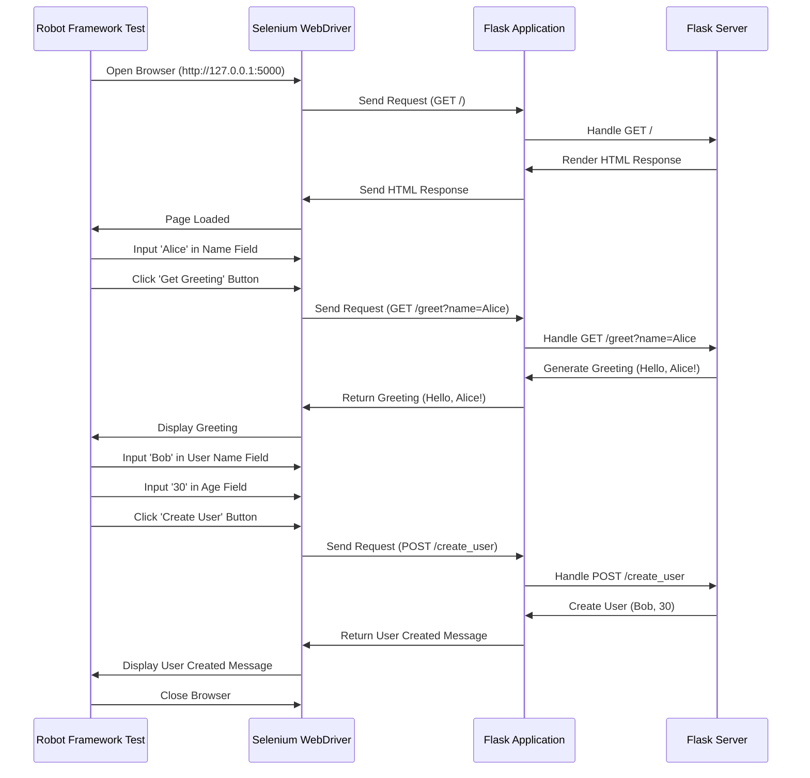

```mermaid
sequenceDiagram
    participant Tester as Robot Framework Test
    participant Browser as Selenium WebDriver
    participant FlaskApp as Flask Application
    participant Server as Flask Server

    Tester->>Browser: Open Browser (http://127.0.0.1:5000)
    Browser->>FlaskApp: Send Request (GET /)
    FlaskApp->>Server: Handle GET /
    Server->>FlaskApp: Render HTML Response
    FlaskApp->>Browser: Send HTML Response
    Browser->>Tester: Page Loaded

    Tester->>Browser: Input 'Alice' in Name Field
    Tester->>Browser: Click 'Get Greeting' Button
    Browser->>FlaskApp: Send Request (GET /greet?name=Alice)
    FlaskApp->>Server: Handle GET /greet?name=Alice
    Server->>FlaskApp: Generate Greeting (Hello, Alice!)
    FlaskApp->>Browser: Return Greeting (Hello, Alice!)
    Browser->>Tester: Display Greeting

    Tester->>Browser: Input 'Bob' in User Name Field
    Tester->>Browser: Input '30' in Age Field
    Tester->>Browser: Click 'Create User' Button
    Browser->>FlaskApp: Send Request (POST /create_user)
    FlaskApp->>Server: Handle POST /create_user
    Server->>FlaskApp: Create User (Bob, 30)
    FlaskApp->>Browser: Return User Created Message
    Browser->>Tester: Display User Created Message

    Tester->>Browser: Close Browser
```
